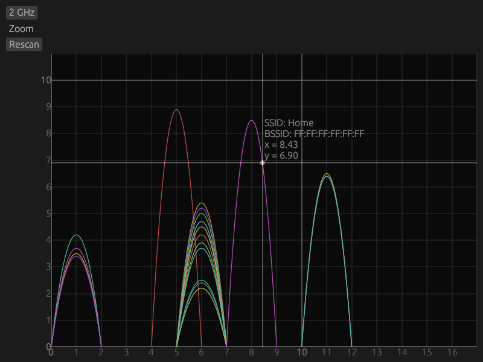

# 📡 Rusty WiFi
Wi-Fi scan visualizer (utility) for Network Manager, written in Rust.



## Note:
Project is at very early stage. For now you can play with it using:
```cargo run```

## TODO
- Auto scan!
- Real error handling.
- Make UI look like human-made thing.
- Move to D-Bus from nmcli parser.
- Support bandwidth with libnm-1.46!
- Flatpak, rpm, deb build!
- Fix github actions.

### Contributes are welcome!
